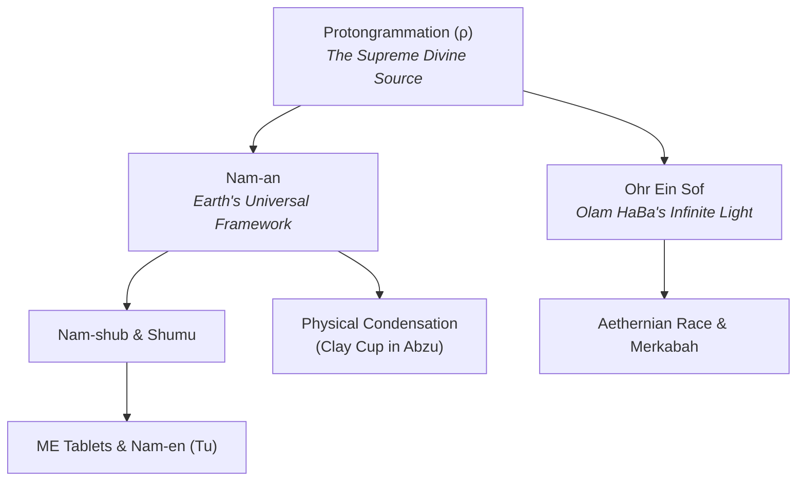

**Protongrammation (ρ)** is the absolute **Divine Source**, the most divine, and the most high entity across all reality. It exists above all frameworks, cosmic orders, dimensions, and gods. Everything in existence originates from Protongrammation, and every power, concept, universe, and divine entity is a downstream derivative of it.

---

## The Supreme Primordial Absolute

Above every universe, divine hierarchy, and reality-shaping power stands **Protongrammation (ρ)**:

- **The Most High & Most Divine:** It is uncreated, transcendent, boundless, and primordial. No concept, entity, or divinity precedes or surpasses it.
- **The Wellspring of Everything:** All matter, consciousness, laws, supernatural energies, and dimensions emerge from Protongrammation. Nothing exists outside of its emanations.
- **Universal Derivatives:** Every divine entity, law system, and cosmic resource across the multiverse is ultimately a localized or cosmological derivative of Protongrammation.
- **Formlessness & The Shared Tree Visualization:** Protongrammation possesses no physical form or tangible physique whatsoever—it is pure, boundless, transcendent absolute existence. However, despite existing in completely separated cosmic dimensions and originating from opposing realms, both **[The One](file:///root/projects/vxnus-studio/EverlastingWarfare/lore/races/aethernian.md)** (god of the Aethernians) and King **[Enki](file:///root/projects/vxnus-studio/EverlastingWarfare/lore/characters/enki.md)** (Lord of Earth) shared the exact same metaphysical visualization of it:
  - When perceiving Protongrammation, both perceived it as a colossal, primordial **Tree** with luminous branches endlessly flowing through the void.
  - Along these flowing branches, distinct universes exist and bud like leaves and fruit, suspended within the overarching currents of its infinite canopy.

---

## Higher-Up Source of the Great Sister Branches

The major primordial divine expressions known across the cosmos—Earth's **[Nam-an](file:///root/projects/vxnus-studio/EverlastingWarfare/lore/overview/nam-an.md)** and the lost Aethernian universe's (**Olam HaBa**) **Ohr Ein Sof**—are parallel manifestations descending directly from **Protongrammation (ρ)**:

1. **Earth's Manifestation ([Nam-an](file:///root/projects/vxnus-studio/EverlastingWarfare/lore/overview/nam-an.md)):** 
   - Within Earth's cosmological realm, the divine presence of Protongrammation expressed itself as **Nam-an**, the supreme supernatural framework and creator of the primordial lineages.
   - Bestowed the reality-manifesting power of **[Nam-shub](file:///root/projects/vxnus-studio/EverlastingWarfare/lore/overview/nam-shub.md)** upon **[Enki](file:///root/projects/vxnus-studio/EverlastingWarfare/lore/characters/enki.md)**, which later condensed into the physical clay cup safeguarded within **[The Abzu](file:///root/projects/vxnus-studio/EverlastingWarfare/lore/overview/abzu.md)**.
2. **Olam HaBa's Manifestation (Ohr Ein Sof):**
   - Within the lost Aethernian home universe of **Olam HaBa**, Protongrammation expressed itself as **Ohr Ein Sof** (the Infinite Divine Light/Resource) that sustained the celestial realm and fueled the **[Aethernian Race](file:///root/projects/vxnus-studio/EverlastingWarfare/lore/races/aethernian.md)**.
   - Following the catastrophic rupture of Ohr Ein Sof by **The One**, the Aethernians embarked across the multiverse seeking its sister derivative to reconstruct their paradise.

---

## Multiversal Significance

Because both **Nam-an** and **Ohr Ein Sof** derive from the exact same supreme source—**Protongrammation (ρ)**—they share equivalent primordial cosmic roots while maintaining dimensional boundary constraints when interacting across realms. Protongrammation remains the undivided, absolute root of all existence.
